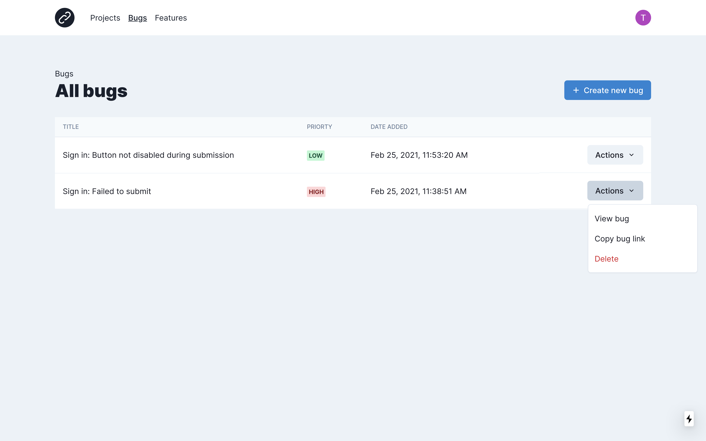
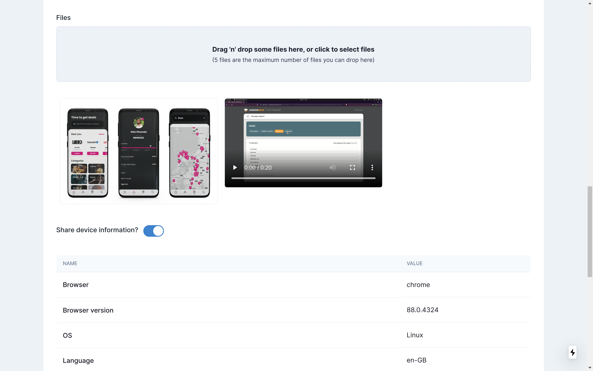

# myissue

[](http://commitizen.github.io/cz-cli/)

> Bug reports and feature requests made simple





## Setup

After cloning the repo, install the required dependencies using `npm`:

```bash
npm install
```

Create a `.env.local` file in the root of the project with the following environment variables:

```bash
# Can be obtained from your firebase configuration
NEXT_PUBLIC_FIREBASE_API_KEY=
NEXT_PUBLIC_FIREBASE_AUTH_DOMAIN=
NEXT_PUBLIC_FIREBASE_PROJECT_ID=
NEXT_PUBLIC_FIREBASE_STORAGE_BUCKET=
NEXT_PUBLIC_FIREBASE_DB_URL=
NEXT_PUBLIC_APP_ID=
FIREBASE_PRIVATE_KEY=
FIREBASE_CLIENT_EMAIL=
```

Now you can run the development server:

```bash
npm run dev
# or
yarn dev
```

Open [http://localhost:3000](http://localhost:3000) with your browser to see the result.

